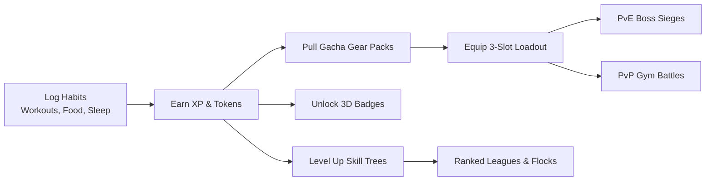

# 🦩 Flamingo Fitness

A vibrant, Duolingo-style gamified fitness and wellness web application that turns health habits (workouts, nutrition, hydration, sleep, and recovery) into RPG-style progression, streaks, skill trees, gacha loot, PvE boss sieges, PvP gym battles, and ranked leagues.

Built with **Django + PostgreSQL + Redis/Celery** with a responsive **Vanilla JS PWA** frontend (no heavy frontend frameworks, fast and mobile-first).

---

## 🌟 PART 1: USER & PLAYER GUIDE

### 🎯 What is Flamingo Fitness?
Flamingo Fitness is designed to make daily health habits as addictive and rewarding as your favorite games. Rather than just staring at dry spreadsheets and charts, every workout you crush, meal you log, and solid night of sleep you get earns you **XP**, levels up your **Skill Trees**, earns **Tokens**, unlocks **Badges**, and powers your player for **PvE & PvP battles**.



---

### 🕹️ Core Game Features

#### 1. 🌳 Skill Trees & Modalities
Progress through 5 core fitness disciplines, each with its own level-up curve and visual path:
- 🏋️ **Strength**: Total volume lifted (lbs), personal records (PRs), and workout frequency.
- 🏃 **Cardio / Endurance**: Total cardio minutes, distance, and zone intensity.
- 🥗 **Nutrition**: Macro accuracy (protein goals) and consistent calorie tracking.
- 💧 **Hydration**: Daily water targets and timing streaks.
- 🌙 **Sleep & Recovery**: Sleep duration, quality, and Garmin Body Battery recovery.

#### 2. 🏅 Achievement Badges (Duolingo-Styled)
- **50+ Built-in Achievements**: Spanning Streaks, Milestones, Nutrition, Weight Loss, Calorie Burn, Sleep Habits, Boss Conquests, PvP Victories, Gear Collecting, and League Standings.
- **3D Gamified Badges**: Vibrant radial medallions with gold sheen, checkmarks, lock indicators, and live progress bars.
- **Mastery Header**: Duolingo-style progress bar displaying total badges unlocked, completion percentage (`% Complete`), and overall Badge Points (`pts`).
- **Category Pills & Instant Search**: Smooth horizontal scrolling filter pills (All, Streaks, Nutrition, Weight, Burn, Sleep, PvE, PvP, Shop, Leagues) and real-time search.
- **Interactive Achievement Popups**: Tap any badge to open an animated 3D achievement card detailing the requirements, reward points, progress tracker, and award date.

#### 3. 🪙 Token Economy & Gacha Shop
- **Earn Tokens**: Earn coins by logging healthy habits, hitting protein targets, maintaining streaks, and completing community challenges.
- **Gacha Gear Packs**: Spend tokens to pull gear packs with bulk discounts (`1x`, `3x` with 10% off, `5x` with 15% off, `10x` with 20% off) and guaranteed rarity minimums (Common, Rare, Epic, Legendary).
- **Scrap Economy**: Recycle unwanted or duplicate gear into scraps, and visit the daily rotating **Scrap Shop** for special items, stamina refills, and crates.

#### 4. ⚔️ Loadout, PvE Boss Sieges & PvP Gyms
- **3-Slot Tactical Loadout**: Equip Helmets, Armor, and Weapons with domain multipliers, synergy effects, and stat bonuses.
- **PvE Campaign Bosses**: Engage in multi-boss campaigns for each modality (*Sir Skip-a-Leg → Iron Couch King → Deadlift Djinn*). Deal damage based on your real-world activity logs!
- **PvP Gym Battles**: Establish your home gym territory, set your defense snapshot, and challenge other players in asynchronous gym battles.

#### 5. 🏆 Leagues, Community Challenges & Flocks
- **Weekly Ranked Leagues**: Compete on weekly XP leaderboards to earn promotion through tiers from *Bronze* all the way to *Flamingo Legend*.
- **Community Challenges**: Join rolling 30-day challenges (e.g. collective calories burned or workouts logged).
- **Flocks**: Form social fitness groups with friends to collaborate, track shared milestones, and chat.

#### 6. 🌓 Theme Modes (Light, Dark, Device, Time)
- **Custom Palettes**: Choose between clean crisp Light mode, neon Miami Dark mode, Device system theme, or automatic Time-based switching (automatically switches to Dark mode between 6:00 PM and 6:00 AM local time).

#### 7. 📱 Mobile PWA Installation
- Install Flamingo Fitness as a standalone Progressive Web App on iOS and Android:
  - **iOS**: Open in Safari → Tap Share icon → **"Add to Home Screen"**.
  - **Android / Chrome**: Tap menu (⋮) → **"Install app"** or **"Add to Home screen"**.

---

### 🔗 Connecting Health Trackers & Providers

Navigate to **Profile** (bottom-nav icon or `/profile/`) to connect your health data providers:

1. **SparkyFitness (`fit.randalls.cc`)**:
   - Paste your API key in the SparkyFitness integration field and tap **Link & Sync**.
   - Automatically ingests your sleep, calories, macros, and hydration logs, awarding XP and tokens on sync (syncs every 4 hours automatically via Celery Beat).
2. **Third-Party Providers & Manual Logging**:
   - Easily log activities directly in the app or sync from integrated fitness APIs.

---

## 🛠️ PART 2: SELF-HOSTER & ADMIN GUIDE

### 🚀 Quick Start (Docker Compose)

The easiest way to self-host Flamingo Fitness is with Docker Compose:

```bash
# 1. Clone repository & copy environment template
git clone https://github.com/Flexingg/FlamingoFitness.git
cd FlamingoFitness
cp .env.example .env

# 2. Edit .env with your secrets and domains
nano .env

# 3. Build and launch the stack
docker compose up -d --build

# 4. (Optional) Seed demo data / initial catalog
docker compose exec web python manage.py seed_demo
```

Access the application:
- **Web App**: `http://localhost:8000` (or your configured `WEB_PORT` / domain)
- **Django Admin**: `http://localhost:8000/admin`
- **Default Superuser**: `admin` / `adminpass123`
- **Default Player**: `player1` / `playerpass123`

---

### ⚙️ Environment Variables (`.env`)

| Variable | Default | Description |
|---|---|---|
| `DJANGO_SECRET_KEY` | `dev-insecure-secret-key...` | Cryptographic signing key (set a long random string in production). |
| `DJANGO_DEBUG` | `False` | Set `False` in production, `True` for development. |
| `DJANGO_ALLOWED_HOSTS` | `localhost,127.0.0.1,web` | Comma-separated allowed hostnames or IPs (e.g. `flamingo.randalls.cc,devflamingo.randalls.cc`). |
| `DJANGO_CSRF_TRUSTED_ORIGINS` | *(empty)* | Comma-separated origins allowed for POST forms (e.g. `https://flamingo.randalls.cc,https://devflamingo.randalls.cc`). |
| `WEB_PORT` | `8000` | Host port mapped to the web container. |
| `POSTGRES_DB` | `flamingo_fitness` | Postgres database name. |
| `POSTGRES_USER` | `flamingo` | Postgres username. |
| `POSTGRES_PASSWORD` | `flamingo-dev-password` | Postgres password. |
| `POSTGRES_HOST` | `db` | Database host container. |
| `POSTGRES_PORT` | `5432` | Database internal port. |
| `REDIS_URL` | `redis://redis:6379/0` | Redis URL for Celery task broker and cache. |
| `DEMO` | `False` | If `True`, enables mock API data for unlinked providers. |

---

### 🌐 Reverse Proxy & SSL Configuration

When hosting behind a reverse proxy (e.g., **Cloudflare Tunnel**, **Nginx Proxy Manager**, **Caddy**, or **Traefik**):

1. **Forward HTTPS Headers**: Django is configured with `SECURE_PROXY_SSL_HEADER = ("HTTP_X_FORWARDED_PROTO", "https")`. Ensure your proxy sets `X-Forwarded-Proto: https` and `X-Forwarded-For: $remote_addr`.
2. **Set Allowed Hosts & CSRF Origins in `.env`**:
   ```ini
   DJANGO_ALLOWED_HOSTS=localhost,127.0.0.1,web,flamingo.randalls.cc,devflamingo.randalls.cc
   DJANGO_CSRF_TRUSTED_ORIGINS=https://flamingo.randalls.cc,https://devflamingo.randalls.cc
   ```
3. **Port Mapping**: The internal Gunicorn server binds to port `8000`. Map your host port via `WEB_PORT=7777` or proxy directly to the container.

---

### 🏛️ Architecture & Services

The Docker Compose stack consists of 5 coordinated services:
- **`web`**: Django application running with Gunicorn (3 workers), serving static assets via WhiteNoise and compressed CSS/JS bundles.
- **`db`**: PostgreSQL 15 database (Alpine). Published on host port `5433` by default to avoid conflicting with host Postgres.
- **`redis`**: Redis 7 cache and Celery broker.
- **`celery_worker`**: Celery asynchronous background worker handling habit evaluations, SparkyFitness syncs, and combat resolutions.
- **`celery_beat`**: Scheduled task runner triggering periodic background syncs every 4 hours.

---

### 🏅 Badge Defs & Rules Customization

Badges require **zero code changes** to create or modify. You can manage them directly via the Django admin (`/admin/` → **Badge defs**) or in `config/seeds/badges.json`:

| `rule.type` | Extra Parameters | Description | Example Rule JSON |
|---|---|---|---|
| `streak` | `minimum` | Earned when streak reaches N days | `{"type": "streak", "minimum": 30}` |
| `activity_logs` | `minimum` | N total activities logged | `{"type": "activity_logs", "minimum": 50}` |
| `perfect_days` | `days` | Activity logged on all N consecutive days | `{"type": "perfect_days", "days": 7}` |
| `skill_level` | `modality`, `minimum` | Specific skill tree reaches level N | `{"type": "skill_level", "modality": "strength", "minimum": 5}` |
| `all_modalities` | `minimum` | All skill trees reach level N | `{"type": "all_modalities", "minimum": 3}` |
| `total_xp` | `minimum` | Lifetime XP reaches N | `{"type": "total_xp", "minimum": 1000}` |
| `time_window` | `before_hour` or `after_hour` | Activity logged in local time window | `{"type": "time_window", "after_hour": 21}` |
| `conquests` | `minimum` | N campaign bosses conquered | `{"type": "conquests", "minimum": 5}` |
| `siege_damage` | `minimum` | N total siege damage dealt | `{"type": "siege_damage", "minimum": 250000}` |
| `pvp_wins` | `minimum` | N gym battles won | `{"type": "pvp_wins", "minimum": 10}` |
| `gear_owned` | `minimum`, `rarity`? | N gear items owned | `{"type": "gear_owned", "minimum": 25}` |
| `league_results` | `minimum` | N ranked league weeks finished | `{"type": "league_results", "minimum": 4}` |
| `league_top3` | `minimum` | N top-3 league finishes | `{"type": "league_top3", "minimum": 1}` |
| `league_tier` | `tier` | Reached specific tier (e.g. `gold`, `flamingo_legend`) | `{"type": "league_tier", "tier": "gold"}` |

---

### 📦 Content Seeding (`config/seeds/`)

All built-in catalog data is stored as plain JSON files in `config/seeds/`:
- `badges.json` → Achievement badges and declarative rules.
- `packs.json` → Gacha Shop crates and packs.
- `gear_items.json` → Droppable weapons, armor, and consumables.
- `scrap_shop.json` → Rotating Scrap Shop deals and weekday schedules.
- `campaign_bosses.json` → PvE bosses, HP pools, and elemental resistances.
- `gameplay.json` → Global balance knobs (XP rates, drop weights, stamina caps).

---

### 💻 Local (Non-Docker) Development

```powershell
# Create and activate Python virtual environment
python -m venv .venv
.venv\Scripts\activate

# Install dependencies
pip install -r requirements.txt

# Run migrations (falls back to local SQLite automatically if no Postgres env)
python manage.py migrate
python manage.py create_demo_accounts

# Run development server
python manage.py runserver
```

#### Running Automated Tests
```powershell
# Run full test suite with test settings
python manage.py test --settings=flamingo_fitness.test_settings

# Run specific badge tests
python manage.py test core.tests.BadgeTests --settings=flamingo_fitness.test_settings
```

---

### 🛠️ Useful Management Commands

```powershell
# Create default demo accounts (admin / player1)
python manage.py create_demo_accounts

# Full demo re-seed
python manage.py seed_demo

# Collect static assets
python manage.py collectstatic --noinput

# Force compress static assets
python manage.py compress --force
```

---

## 📄 License
MIT License. Built for fitness enthusiasts, self-hosters, and gamers.

