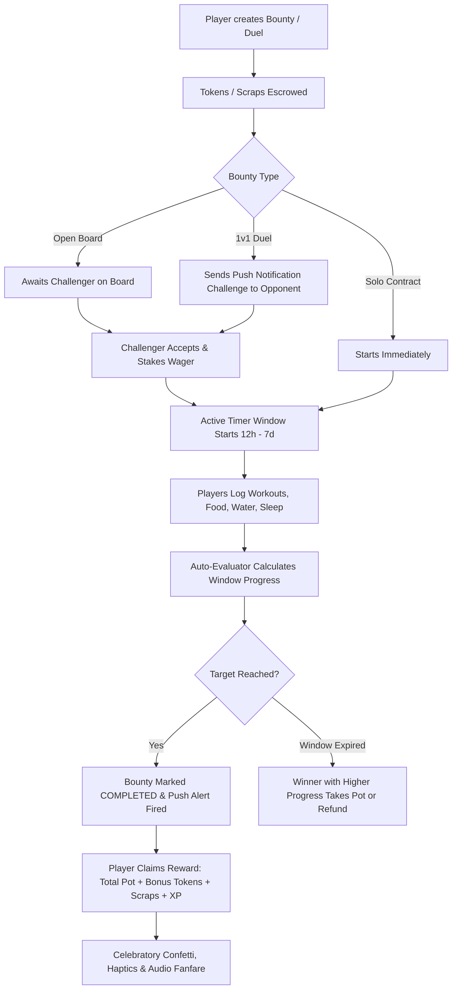

# 🎯 20. Interactive Fitness Bounty Board & 1v1 Duels (Roadmap Item N8)

## 📌 Overview
The **Bounty Board & 1v1 Fitness Duels** system introduces interactive fitness wagers, solo micro-contracts, community challenge boards, and head-to-head friend duels to Flamingo Fitness.

Players can stake in-game **Tokens** or **Scraps** into smart escrow, challenge friends or open lobby members to time-bounded fitness challenges, and have their progress automatically verified against verified activity logs across all 5 core habit modalities.

---

## 🕹️ Core Game Mechanics

---

## 📊 Supported Goal Metrics & Modalities

| Target Metric (`target_type`) | Modality | Default Goal | Unit | Ingestion Sources |
|---|---|---|---|---|
| `steps` | Endurance | 10,000 | steps | Health Connect, Garmin, Apple Health, Manual |
| `cardio_minutes` | Endurance | 30 | mins | SparkyFitness, Peloton, Manual Quick Log |
| `strength_volume` | Strength | 15,000 | lbs volume | Liftosaur sync, Manual Strength Log |
| `water_ml` | Hydration | 2,500 | ml | SparkyFitness, Health Connect, Quick Log |
| `protein_g` | Nutrition | 140 | grams | SparkyFitness food search, Quick Log |
| `calories_burned` | Endurance | 500 | active kcal | Wearable active calories, Workout logs |
| `workout_count` | Strength / Endurance | 1 | sessions | Strength or cardio activity sessions |
| `sleep_hours` | Recovery | 8.0 | hours | SparkyFitness / Garmin sleep tracking |

---

## 🪙 Escrow & Wager Economics

1. **Solo Contracts**:
   - Creator stakes $N$ tokens or scraps as a commitment contract.
   - Upon verified completion within the time window ($12\text{h}-7\text{d}$), creator receives:
     $$\text{Payout} = \text{Staked Wager} + \text{Bonus System Tokens (15🪙)} + \text{Bonus XP (50-100 XP)}$$
2. **1v1 Duels**:
   - Creator stakes $W$ tokens. Opponent matches $W$ tokens upon accepting the challenge.
   - Total escrow pot ($2W$) + 25 Bonus Tokens are locked in contract.
   - First player to crush the goal (or highest progress if timer expires) claims the full pot:
     $$\text{Winner Payout} = 2W + 25\text{ Bonus Tokens} + \text{Full Reward XP}$$
     $$\text{Consolation} = 25\%\text{ Consolation XP for effort}$$
3. **Open Community Board**:
   - Players or **Sir Fluffington** post open bounties with prize pools.
   - Daily system contracts auto-replenish every 24 hours so players always have 3 fresh quests to accept.

---

## 🔔 Mobile Push Notifications & Native Bridge Integration

- **Duel Invites**: When @user challenges a friend, an instant native push notification is dispatched via `dispatch_push_notification` and the Flutter native bridge (`window.FlamingoNative.showNotification`).
- **Duel Accepted**: Challenger is alerted when the opponent enters the ring and the timer begins.
- **Victory & Completion**: Haptic rumble (`HapticFeedback.heavyImpact`), Web Audio oscillator fanfare (`window.FlamingoAudio.playBadgeUnlock`), and celebratory full-screen confetti burst upon claiming.

---

## 🔌 API Endpoints

| Method | Endpoint | Description |
|---|---|---|
| `GET` | `/bounties/state` | Retrieves active bounties, open board, direct duels, claimed vault, and wallet balances. |
| `POST` | `/bounties/create` | Creates a new solo contract, open bounty, or 1v1 duel with escrow locking. |
| `POST` | `/bounties/<id>/accept` | Accepts an open contract or direct duel challenge and stakes matching escrow. |
| `POST` | `/bounties/<id>/cancel` | Cancels an unaccepted bounty and returns escrowed funds to creator. |
| `POST` | `/bounties/<id>/claim` | Claims token pot, scraps, and awards XP to the respective skill tree. |

---

## ⚙️ Periodic Celery Maintenance

- **`evaluate_and_expire_bounties_task`**: Runs periodically in Celery Beat to ensure daily system quests are refreshed, evaluate in-progress duels, and refund expired unaccepted bounties past 48 hours.
